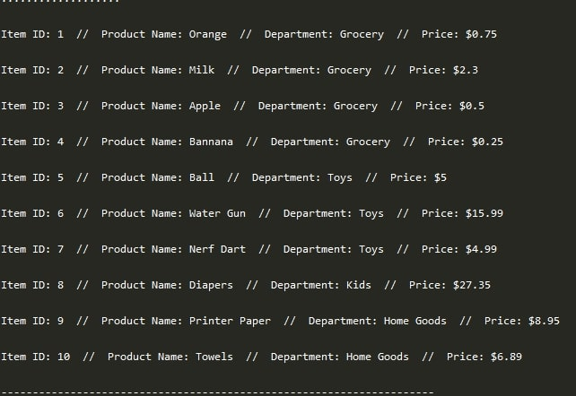
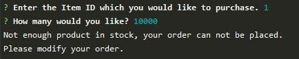
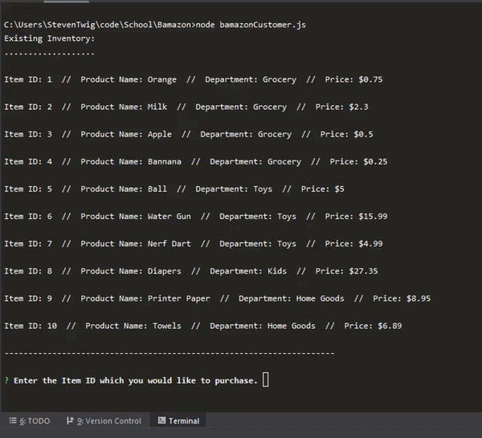

# Bamazon

Bamazon is a storefront which utilizes MySQL and node.js.

# Functionality
* The app first displays all items available for sale in the bamazon inventory.
#

#
* The app will then prompt users with two messages.
* It will ask for the ID of the product that they would like to buy and how many units of the product they would like to buy.
#

#
* Once the customer has placed the order, the app will check if the store has sufficient inventory to fill the request.
* If it cannot the app will log the phrase "Not enough product in stock, your order can not be placed.", and prevent the order from going through.
#

#
* I something is bought, the app updates the database to reflect the remaining inventory.
# Demo GIF

1